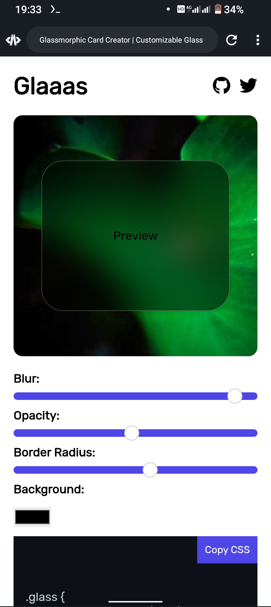

# Glaas | Glassmorphic Card Creator

A customizable and interactive tool to generate **glassmorphic cards** with beautiful glass effects. This tool allows you to design your own cards with transparency, blurs, and other glass effects using just CSS. Perfect for adding sleek, modern, and stylish UI components to your website or application.



---

## Features

- **Customizable Glass Effect**: Control transparency, blur, and other glassmorphism effects.
- **Interactive UI**: Real-time updates of your design as you adjust settings.
- **CSS and TailwindCSS Code Generator**: Generate both regular CSS code and its equivalent TailwindCSS classes to use in your project.
- **Responsive**: Works perfectly on all screen sizes.
- **Easy to Use**: No coding required. Simply adjust the sliders and copy the generated code.
- **Open Source**: Free to use and contribute to.

---

## Demo

You can see the live demo of the Glassmorphic Card Creator [here](https://yourwebsite.com).

---

## Installation

To use the Glassmorphic Card Creator locally or as part of your project:

1. Clone the repository:
    ```bash
    git clone https://github.com/Habib-0007/glaas.git
    ```

2. Navigate to the project folder:
    ```bash
    cd glassmorphic-card-creator
    ```

5. Open your code editor and browser to run and display the code.

---

## How It Works

1. **Design Your Card**: 
    - Adjust settings like transparency, blur radius, and border radius.
    - Select your desired color scheme for the card.

2. **View Real-Time Updates**:
    - As you modify settings, the card design updates immediately in the preview section.

3. **Generate Code**:
    - Copy the generated CSS code or TailwindCSS classes to use in your project.

---

## Code Example

```html
<pre><code class="language-css">
/* Example of generated CSS */
.glass-card {
    background: rgba(255, 255, 255, 0.1);
    backdrop-filter: blur(10px);
    border-radius: 15px;
}
</code></pre>